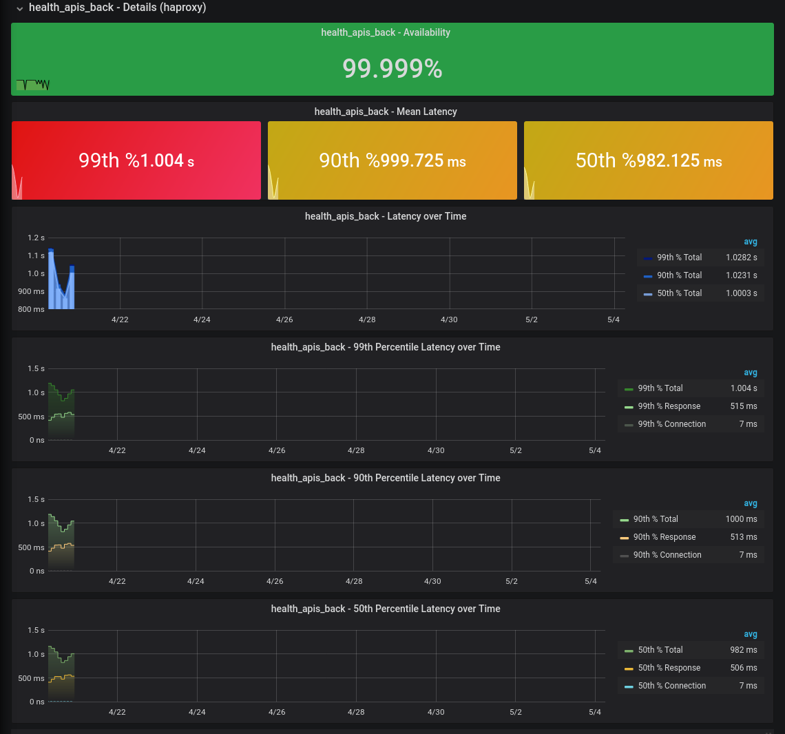

#  SLO Document

> Adapted from [Google SLO Example](https://landing.google.com/sre/workbook/chapters/slo-document/)

This document describes the (reflective) SLOs for the  external service.

|               |                |
| ------------- | -------------- |
| Status        | DRAFT |
| Author        | Keifer Furzland |
| Changed       | 2020-04-27 |

## Service Overview

> This section provides an overview of what data the service provides and how it can be used by teams building on VSP.

| Service Name | API Service Tag | `haproxy` label |
| ------------ | --------------- | --------------- |
| Health APIS | `` | `health_apis_back` |

### SLO Performance (14d Rolling)

> This section includes dashboard links to service-specific panels from [Grafana](http://grafana.vfs.va.gov/) 

- :bar_chart: [**14d SLI Dashboard**](http://grafana.vfs.va.gov/d/pEgVdRlZk/external-service-performance-indicators?orgId=1&var-backend=health_apis_back)

##### Helpful Links

- :link: [Integration Details](test)
- :link: [`vets-api/`]()

  
## SLIs and SLOs

- The SLO is measured over a 14 day rolling window at a minimum one hour interval.
- Currently SLOs are measured for service-level. Eventually these will be enforced per-endpoint.

| Category         | SLI                                                                                                                                                                | SLO                                                                           |
| ---------------- | ------------------------------------------------------------------------------------------------------------------------------------------------------------------ | ----------------------------------------------------------------------------- |
| Availability  | The proportion of successful HTTP requests as measured by the `haproxy` metrics.   Any HTTP status other than 500-599 is considered successful.          | 99.00% success                                                                |
| Latency          | The proportion of sufficiently fast requests.    "Sufficiently fast" is defined as < ms, ms,  ms as measured by the `haproxy` metrics.1 | <ul><li> 50% of requests < ms <li>90% of requests ms</li> <li> 99% of requests < ms</li></li></ul> |

## Rationale

Availability and latency SLIs are based on measurements of average request-response timings. 

Availability SLOs were rounded down to the nearest 100ms and latency SLO timings were rounded up to the nearest 100ms.

All other numbers were picked by the author and the services were verified to be running at or above those levels.

**No attempt has yet been made to verify that these numbers correlate strongly with user experience.**

## Error Budget

> Each objective has a separate error budget, defined as 100% minus (–) the goal for that objective. For example, if there have been 1,000,000 requests to the API server in the previous four weeks, the API availability error budget is 3% (100% – 97%) of 1,000,000: 30,000 errors.

> We will enact the error budget policy (see [Example Error Budget Policy](https://landing.google.com/sre/workbook/chapters/error-budget-policy/)) when any of our objectives has exhausted its error budget.

## Clarifications and Caveats 

- [1]: These SLIs are using metrics from `breakers` because current `fwdproxy` configurations do not allow for endpoint-level resolution to be analyzed. 
-  Request metrics are measured at the forward proxy. This measurement may fail to accurately measure cases where user requests didn’t reach the forward proxy.
-  We only count HTTP 5XX status messages as error codes; everything else is counted as success.

----

> __This document was autogenerated on 2020-04-27__
